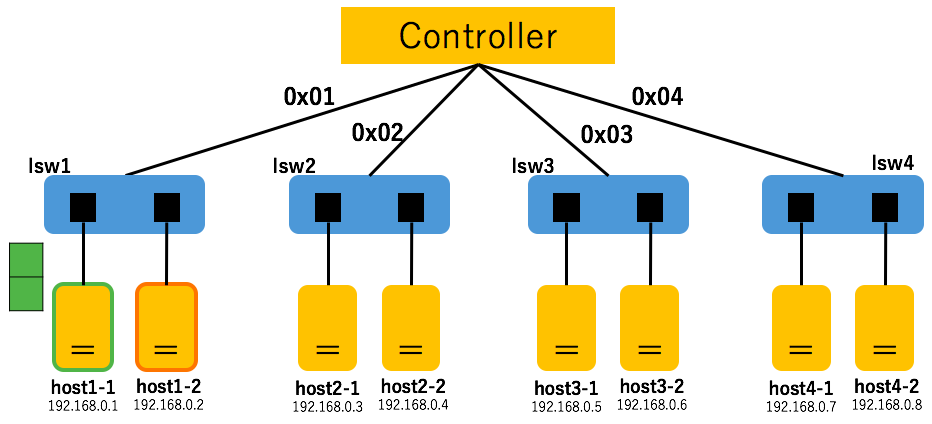
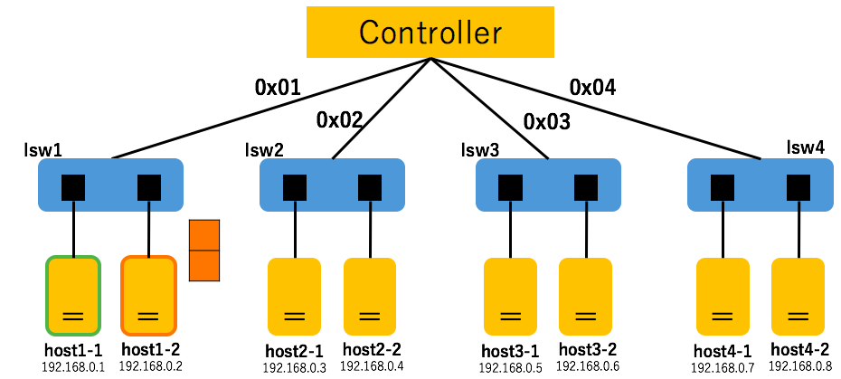

#Report: learning-switch
Submission: Oct./12/2016  
Branch:     develop  

##提出者
辻　健太  
33E16012  
長谷川研究室 所属  

## SDNの構造
`trema.multi.conf`より，  
SDNの構造はFig.1の通りになった．  

||  
|:------------------------------------------------:|  
|                     Fig.1                        |  

##実施内容
それぞれのスイッチ（lsw1 ~ lsw4）は独立しており，  
かつどのスイッチも同じ構造をしているため，  
１つのスイッチ（今回はlsw1）に対して下記２つのことを行った．

###１．プログラムの解読
`lib/multi*learnig*switch.rb`および`lib/fdb.rb`より，  
到着したパケットに対して下記の順序で動作すると考察した．  

####① FDB（Forwarding DB）への登録
fdbへ送信車のMACアドレス，入力ポート番号（Entry）を登録する．    
このとき，FDBに入力Entryがあれば，ポート番号（現時刻も）を更新する．  
そして，FDBに入力Entryがなければ，新しくEntryを作り，FDBに格納する．
ちなみに，FDB.age()を呼び出せば，最大時間（age*max: 300）を超えたエントリーはFDBから排除される．  
>参照：
> * [MultiLearningSwitch.packet*in()](lib/multi*learning*switch.rb)  
> * [FDB.learn()](lib/fdb.rb)  

####② フローテーブルの規則を生成
FDBから宛先のMACアドレスおよび宛先につながるポート番号（Entry）を取得する．  
このとき，Entryが存在すれば，入力パケット（の宛先）に対しては取得したEntryに含まれるポート番号へ出力する規則をつくる．  
そして，FDBにEntryがなければ，そのまま③に進む．

###③ 入力パケットの出力
②において決まった出力ポートに入力パケットを出力する．  
しかし，②において出力ポートが定まっていないならば，入力パケットを全てのポートへ出力する．  

###２．確認
`１．`を実証するため，  
lsw1において，下記の順でパケットを送り合わせて見た．  

####送信１
<b>送信者：</b> host1-1  
<b>受信者：</b> host1-1  

<b>直後フローテーブル：</b>  

cookie=0x0, duration=7.658s, table=0, n*packets=0, n*bytes=0, idle*age=7, priority=65535,udp,in*port=1,vlan*tci=0x0000,dl*src=dd:36:82:ff:45:88,dl*dst=dd:36:82:ff:45:88,nw*src=192.168.0.1,nw*dst=192.168.0.1,nw*tos=0,tp*src=0,tp*dst=0 actions=output:1

<b>結果の解釈：</b>

この処理によってFDBにhost1-1のMACアドレスおよびポート番号（１）が登録された．そして，フローテーブルにおいて，入力パケットに対してはポート1へ出力する規則が生成された．

####送信２
<b>送信者：</b> host1-2  
<b>受信者：</b> host1-2  

<b>直後フローテーブル：</b>  

cookie=0x0, duration=18.921s, table=0, n*packets=0, n*bytes=0, idle*age=18, priority=65535,udp,in*port=2,vlan*tci=0x0000,dl*src=cb:95:96:e6:9d:03,dl*dst=cb:95:96:e6:9d:03,nw*src=192.168.0.2,nw*dst=192.168.0.2,nw*tos=0,tp*src=0,tp*dst=0 actions=output:2

cookie=0x0, duration=38.093s, table=0, n*packets=0, n*bytes=0, idle*age=38, priority=65535,udp,in*port=1,vlan*tci=0x0000,dl*src=dd:36:82:ff:45:88,dl*dst=dd:36:82:ff:45:88,nw*src=192.168.0.1,nw*dst=192.168.0.1,nw*tos=0,tp*src=0,tp*dst=0 actions=output:1

<b>結果の解釈：</b>

FDBにhost1-2のMACアドレスおよびポート番号（２）が登録された．そして，フローテーブルにおいて，入力パケットに対してはポート1へ出力する規則が生成された．

####送信3
<b>送信者：</b> host1-1  
<b>受信者：</b> host1-2  

<b>直後フローテーブル：</b>  

cookie=0x0, duration=5.949s, table=0, n*packets=0, n*bytes=0, idle*age=5, priority=65535,udp,in*port=1,vlan*tci=0x0000,dl*src=dd:36:82:ff:45:88,dl*dst=cb:95:96:e6:9d:03,nw*src=192.168.0.1,nw*dst=192.168.0.2,nw*tos=0,tp*src=0,tp*dst=0 actions=output:2

cookie=0x0, duration=54.431s, table=0, n*packets=0, n*bytes=0, idle*age=54, priority=65535,udp,in*port=2,vlan*tci=0x0000,dl*src=cb:95:96:e6:9d:03,dl*dst=cb:95:96:e6:9d:03,nw*src=192.168.0.2,nw*dst=192.168.0.2,nw*tos=0,tp*src=0,tp*dst=0 actions=output:2

cookie=0x0, duration=73.603s, table=0, n*packets=0, n*bytes=0, idle*age=73, priority=65535,udp,in*port=1,vlan*tci=0x0000,dl*src=dd:36:82:ff:45:88,dl*dst=dd:36:82:ff:45:88,nw*src=192.168.0.1,nw*dst=192.168.0.1,nw*tos=0,tp*src=0,tp*dst=0 actions=output:1

<b>結果の解釈：</b>  

フローテーブルにおいて，入力パケットに対してはポート2へ出力する規則が生成された．

####送信4
<b>送信者：</b>  host1-2  
<b>受信者：</b>  host1-1  

<b>直後フローテーブル：</b>    

cookie=0x0, duration=6.857s, table=0, n*packets=0, n*bytes=0, idle*age=6, priority=65535,udp,in*port=2,vlan*tci=0x0000,dl*src=cb:95:96:e6:9d:03,dl*dst=dd:36:82:ff:45:88,nw*src=192.168.0.2,nw*dst=192.168.0.1,nw*tos=0,tp*src=0,tp*dst=0 actions=output:1

cookie=0x0, duration=31.096s, table=0, n*packets=0, n*bytes=0, idle*age=31, priority=65535,udp,in*port=1,vlan*tci=0x0000,dl*src=dd:36:82:ff:45:88,dl*dst=cb:95:96:e6:9d:03,nw*src=192.168.0.1,nw*dst=192.168.0.2,nw*tos=0,tp*src=0,tp*dst=0 actions=output:2

cookie=0x0, duration=79.578s, table=0, n*packets=0, n*bytes=0, idle*age=79, priority=65535,udp,in*port=2,vlan*tci=0x0000,dl*src=cb:95:96:e6:9d:03,dl*dst=cb:95:96:e6:9d:03,nw*src=192.168.0.2,nw*dst=192.168.0.2,nw*tos=0,tp*src=0,tp*dst=0 actions=output:2

cookie=0x0, duration=98.75s, table=0, n*packets=0, n*bytes=0, idle*age=98, priority=65535,udp,in*port=1,vlan*tci=0x0000,dl*src=dd:36:82:ff:45:88,dl*dst=dd:36:82:ff:45:88,nw*src=192.168.0.1,nw*dst=192.168.0.1,nw*tos=0,tp*src=0,tp*dst=0 actions=output:1

<b>結果の解釈：</b>

フローテーブルにおいて，入力パケットに対してはポート2へ出力する規則が生成された．

##関連リンク
* [SDNの構成] (trema.multi.conf)
* [ソース元] (lib)
* [画像集] (img)
* [出力結果] (out)
