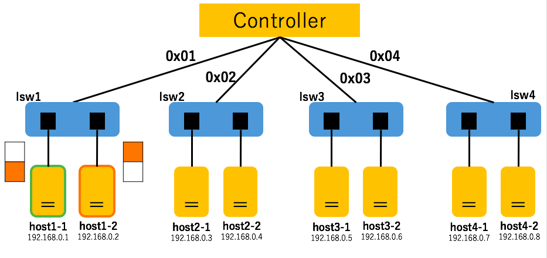

#Report: learning-switch
Submission: Oct./12/2016  

##提出者
辻　健太  
33E16012  
長谷川研究室 所属  

## SDNの構造
`trema.multi.conf`より，SDNの構造はFig.1の通りになった．  

||  
|:------------------------------------------------:|  
|                     Fig.1                        |  

##実施内容

下記２つのことを行った．

###１．互いにパケットを送り合う．
まず，それぞれのスイッチ（lsw1 ~ lsw4）において，  
ホスト同士でパケット送り合う．  
（下記はlsw1のみ）  

|  送信者  |   受信者    |                      イメージ                    |  
|:-------:|:----------:|:-----------------------------------------------:|  
| host1-1 |  host1-2   ||  
| host1-2 |  host1-1   ||  

##関連リンク
* [images] (img)
