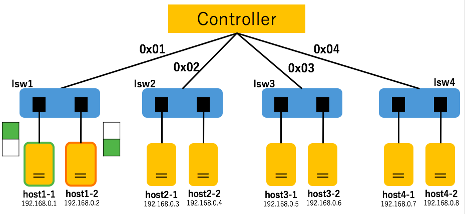

#Report: learning-switch
Submission: Oct./12/2016  

##提出者
辻　健太  
33E16012  
長谷川研究室 所属  

## SDNの構造
`[trema.multi.conf](trema.multi.conf)`より，  
SDNの構造はFig.1の通りになった．  

||  
|:------------------------------------------------:|  
|                     Fig.1                        |  

##実施内容
それぞれのスイッチ（lsw1 ~ lsw4）は独立しており，  
かつどれも同じ構造をしているため，  
１つのスイッチ（今回はlsw1）に対して下記２つのことを行った．

###１．プログラムの解読
`lib/multi_learnig_switch.rb[lib/multi_learnig_switch.rb]`より，

###２．確認
lsw1において，下表のようにでパケット送り合う．  

| 実行順 |  送信者  |   受信者    |                      イメージ                    |Flow table   |  
|:-----:|:-------:|:----------:|:-----------------------------------------------:|:------------|  
|   1   | host1-1 |  host1-2   ||None         |  
|   2   | host1-1 |  host1-2   ||None         |  
|   3   | host1-2 |  host1-1   ||* cookie=0x0, duration=12.917s, table=0, n_packets=0, n_bytes=0, idle_age=12, priority=65535,udp,in_port=2,vlan_tci=0x0000,dl_src=fe:cf:9f:34:01:de,dl_dst=d9:7e:76:8d:10:25,nw_src=192.168.0.2,nw_dst=192.168.0.1,nw_tos=0,tp_src=0,tp_dst=0 actions=output:1|  
|   4   | host1-1 |  host1-2   ||* cookie=0x0, duration=45.867s, table=0, n_packets=0, n_bytes=0, idle_age=45, priority=65535,udp,in_port=1,vlan_tci=0x0000,dl_src=d9:7e:76:8d:10:25,dl_dst=fe:cf:9f:34:01:de,nw_src=192.168.0.1,nw_dst=192.168.0.2,nw_tos=0,tp_src=0,tp_dst=0 actions=output:2
* cookie=0x0, duration=79.714s, table=0, n_packets=0, n_bytes=0, idle_age=79,priority=65535,udp,in_port=2,vlan_tci=0x0000,dl_src=fe:cf:9f:34:01:de,dl_dst=d9:7e:76:8d:10:25,nw_src=192.168.0.2,nw_dst=192.168.0.1,nw_tos=0,tp_src=0,tp_dst=0 actions=output:1|  

##関連リンク
* [trema.multi.conf] (trema.multi.conf)
* [lib/multi_learnig_switch.rb] (lib/multi_learnig_switch.rb)
* [images] (img)
